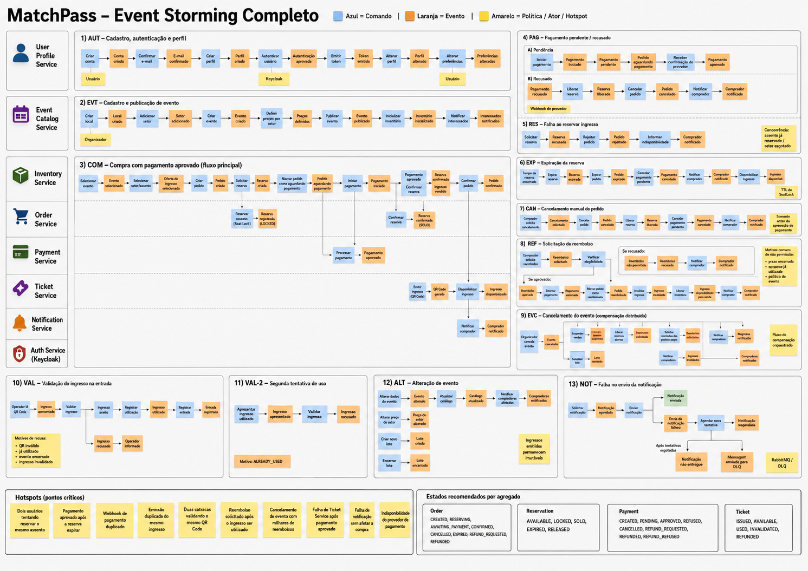
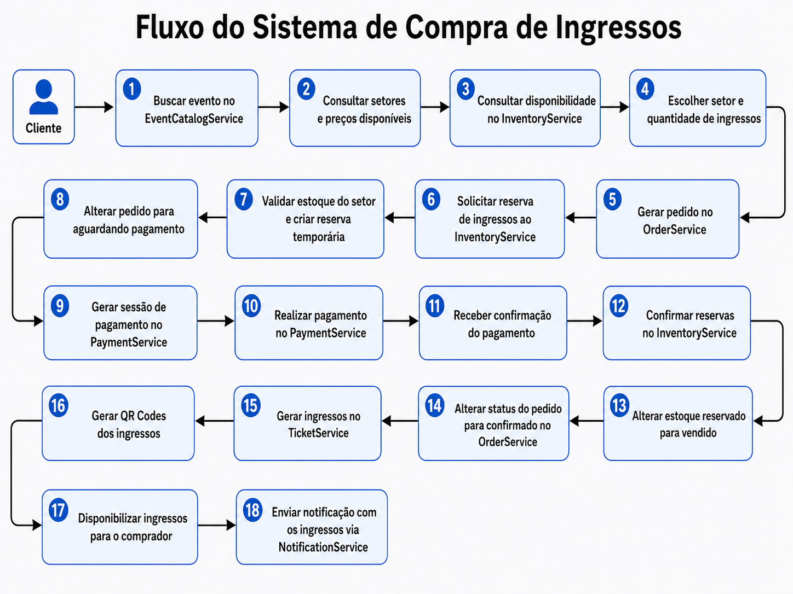
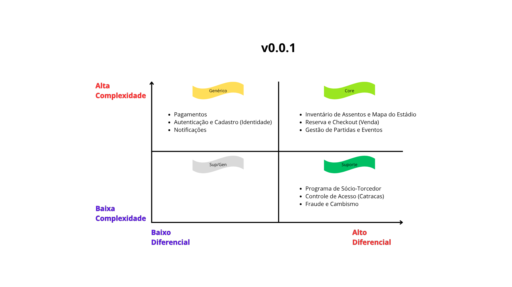
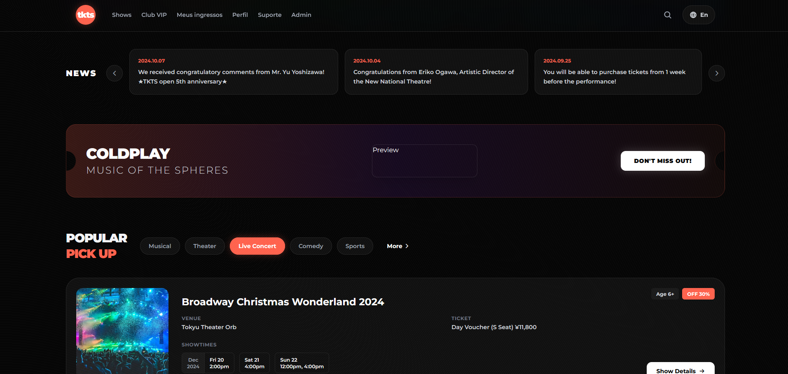
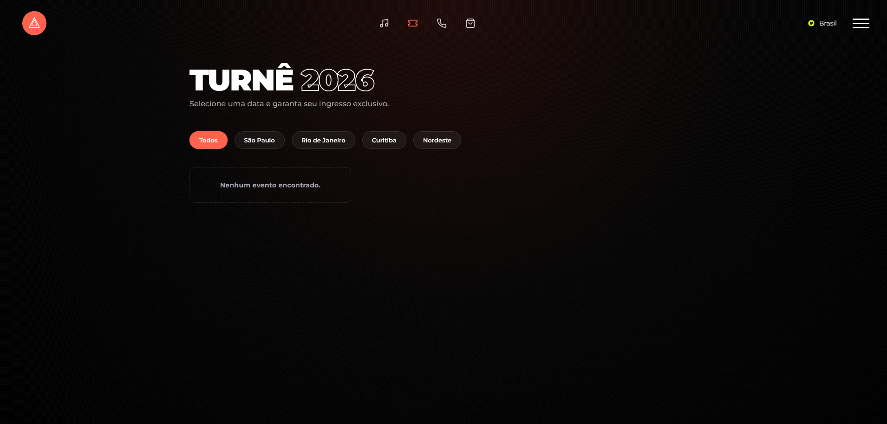
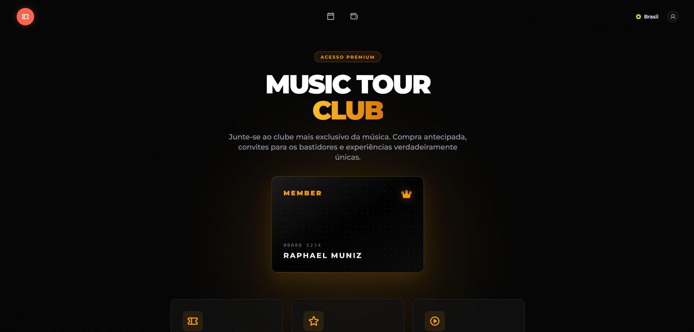

# Reservae

<div align="center">
  <a href="https://github.com/RaphaelMun1z/ReservaeProject/releases/latest">
    
  </a>
  
  
  
  
</div>

Plataforma de venda e gestão de ingressos para eventos, como shows, festivais, conferências e competições esportivas. A solução conecta organizadores e participantes em uma jornada que abrange a publicação do evento, a reserva, o pagamento, a emissão do ingresso e o controle de acesso.

> **Versão atual do backend:** `v1.0.0`<br>
> **Estágio:** MVP funcional

## Arquitetura

O backend segue uma arquitetura de microsserviços. Cada serviço representa uma responsabilidade de negócio, possui persistência própria quando necessário e se registra no Eureka. As requisições externas passam pelo API Gateway; APIs REST atendem às operações síncronas e eventos Kafka integram as etapas assíncronas da jornada.

### Domínios

| Categoria    | Subdomínios                                                                    | Papel no sistema                                           |
| :----------- | :----------------------------------------------------------------------------- | :--------------------------------------------------------- |
| **Core**     | Catálogo de eventos e locais, inventário, reserva, pedido, checkout e ingresso | Concentra a venda e o acesso aos eventos                   |
| **Suporte**  | Notificações e controle de acesso                                              | Complementa a experiência de organizadores e participantes |
| **Genérico** | Identidade, autenticação e pagamentos                                          | Fornece capacidades compartilhadas por todo o sistema      |

### Documentação visual

Os diagramas abaixo registram a concepção arquitetural que originou o MVP.

<div align="center">
  
  
</div>

<div align="center">
  
  
</div>

## Portas e serviços

### Infraestrutura de apoio

| Status | Componente                 | Porta local | Papel                                         |
| :----: | :------------------------- | :---------: | :-------------------------------------------- |
|   ✅   | Spring Cloud Config Server |   `8888`    | Configuração centralizada dos serviços        |
|   ✅   | Eureka Naming Server       |   `8761`    | Registro e descoberta de serviços             |
|   ✅   | API Gateway                |   `8765`    | Roteamento das APIs e acesso ao Swagger       |
|   🔴   | Zipkin Server              |   `9411`    | Rastreamento distribuído                      |
|   ✅   | Keycloak                   |   `8080`    | Identidade, autenticação e autorização        |
|   ✅   | Apache Kafka               |   `29092`   | Mensageria e integração orientada a eventos   |
|   ✅   | ZooKeeper                  |   `22181`   | Coordenação do broker Kafka                   |
|   ✅   | Kafka UI                   |   `8090`    | Inspeção de tópicos, consumidores e mensagens |
|   ⚪   | Frontend Angular           |      —      | Diretório reservado para a futura aplicação   |

### Microsserviços e persistência

| Status do serviço | Status do banco | Microsserviço         | Porta da aplicação | Persistência    | Porta local do banco | Database           |
| :---------------: | :-------------: | :-------------------- | :----------------: | :-------------- | :------------------: | :----------------- |
|        ✅         |       ✅        | User Profile Service  |       `8000`       | PostgreSQL 18.4 |        `5432`        | `db_user_profile`  |
|        ✅         |       ✅        | Event Catalog Service |       `8100`       | PostgreSQL 18.4 |        `5433`        | `db_event_catalog` |
|        ✅         |       ✅        | Inventory Service     |       `8200`       | Redis 7         |        `6379`        | —                  |
|        ✅         |       ✅        | Order Service         |       `8300`       | PostgreSQL 18.4 |        `5434`        | `db_order`         |
|        ✅         |       ✅        | Payment Service       |       `8400`       | PostgreSQL 18.4 |        `5436`        | `db_payment`       |
|        ✅         |       ✅        | Ticket Service        |       `8500`       | PostgreSQL 18.4 |        `5435`        | `db_ticket`        |
|        ✅         |       ✅        | Notification Service  |       `8600`       | MongoDB 7       |       `27017`        | `db_notification`  |

> As portas listadas são as portas expostas no host pelo ambiente local. Internamente, os contêineres PostgreSQL utilizam a porta `5432`, o Kafka utiliza `9092`, o ZooKeeper utiliza `2181` e o Kafka UI utiliza `8080`.

## Stack tecnológica

### Backend

- **Java 21:** linguagem e plataforma de execução dos microsserviços.
- **Spring Boot 3.5:** base para criação das APIs e componentes do backend.
- **Spring Cloud:** centraliza configurações, roteia requisições, descobre serviços e oferece comunicação declarativa com Config, Gateway, Eureka e OpenFeign.
- **Spring Data JPA:** abstrai o acesso aos bancos relacionais.
- **PostgreSQL:** persiste perfis, eventos, pedidos, pagamentos e ingressos.
- **Redis:** mantém o inventário e as reservas temporárias com acesso de baixa latência.
- **MongoDB:** armazena os registros de notificações.
- **Apache Kafka:** transporta eventos entre os microsserviços.
- **Spring Security, OAuth 2.0 e Keycloak:** protegem as APIs e gerenciam identidade e autorização.
- **Stripe:** processa o checkout e informa o resultado dos pagamentos por webhook.
- **Flyway:** versiona e aplica as migrações do banco do Payment Service.
- **Resilience4j:** adiciona mecanismos de resiliência às integrações.
- **OpenAPI/Swagger:** documenta e permite explorar as APIs.

### Frontend

- **Protótipo web:** telas navegáveis disponíveis em `frontend/prototipo-reservae`.
- **Angular:** diretório `frontend/angular-reservae` reservado para a futura aplicação.

### Infraestrutura

- **Docker e Docker Compose:** provisionam os bancos, o Keycloak e a mensageria do ambiente local.
- **Kafka UI:** permite acompanhar tópicos, mensagens e consumidores.

## Como executar localmente

### Pré-requisitos

- Java 21;
- Maven 3.9 ou superior;
- Docker com Docker Compose;
- Stripe CLI para testar webhooks de pagamento;
- credenciais da Stripe e de um provedor de e-mail Brevo.

### 1. Inicie a infraestrutura e os bancos

```bash
cd microservices-spring-kafka-reservae
docker compose up -d
```

Esse comando inicia PostgreSQL, Redis, MongoDB, Keycloak, ZooKeeper, Kafka e Kafka UI.

### 2. Configure as integrações

Defina as variáveis de ambiente exigidas pelos serviços:

```text
STRIPE_SECRET_KEY
STRIPE_WEBHOOK_SECRET
BREVO_API_KEY
NOTIFICATION_EMAIL
OAUTH2_ISSUER_URI
TOKEN_GENERATION_URL
```

No Keycloak, crie ou configure o realm e os clientes da aplicação. Use a URL do emissor do realm em `OAUTH2_ISSUER_URI` e a URL necessária para obtenção de token em `TOKEN_GENERATION_URL`.

### 3. Inicie os componentes Java

Abra um terminal para cada módulo e execute:

```bash
mvn spring-boot:run
```

Use esta ordem de inicialização:

1. `spring-cloud-config-server`
2. `naming-server`
3. `api-gateway`
4. `user-profile-service`
5. `event-catalog-service`
6. `inventory-service`
7. `order-service`
8. `payment-service`
9. `ticket-service`
10. `notification-service`

Os serviços usam o perfil `dev` e obtêm suas configurações pelo Config Server.

### 4. Encaminhe os webhooks da Stripe

```bash
stripe listen --forward-to localhost:8400/payment-service/api/payments/webhooks/v1/stripe
```

Copie o segredo exibido pela Stripe CLI para `STRIPE_WEBHOOK_SECRET` antes de iniciar o Payment Service.

### 5. Acesse o protótipo

Abra `frontend/prototipo-reservae/index.html` no navegador. O diretório
`frontend/angular-reservae` está reservado e ainda não contém uma aplicação.

## Endpoints de apoio

| Recurso          | URL                                     |
| :--------------- | :-------------------------------------- |
| API Gateway      | `http://localhost:8765`                 |
| Swagger UI       | `http://localhost:8765/swagger-ui.html` |
| Eureka Dashboard | `http://localhost:8761`                 |
| Keycloak         | `http://localhost:8080`                 |
| Kafka UI         | `http://localhost:8090`                 |

## Relato de bugs

Encontrou um comportamento inesperado? [Crie uma issue no repositório](https://github.com/RaphaelMun1z/ReservaeProject/issues/new) com uma descrição objetiva, os passos para reproduzir, o resultado esperado e, quando possível, logs ou capturas de tela. Antes de abrir uma nova issue, verifique se o problema já foi relatado.

## Interface da aplicação

<div align="center">
  
  &nbsp;&nbsp;
  
</div>

<br>

<div align="center">
  
  &nbsp;&nbsp;
  
</div>
