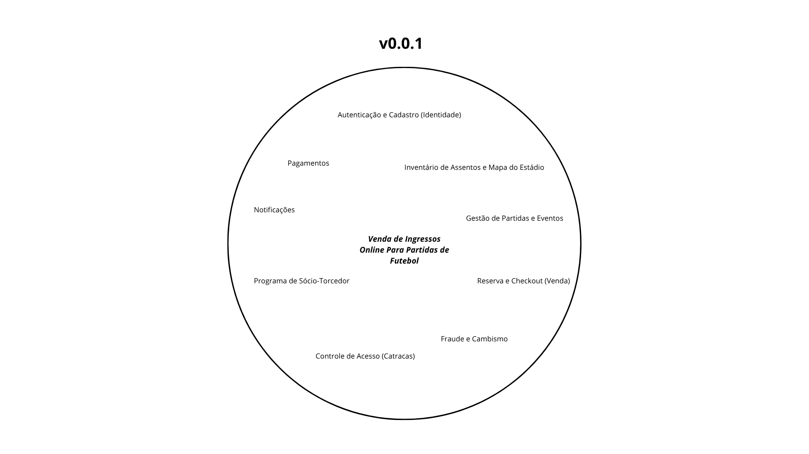
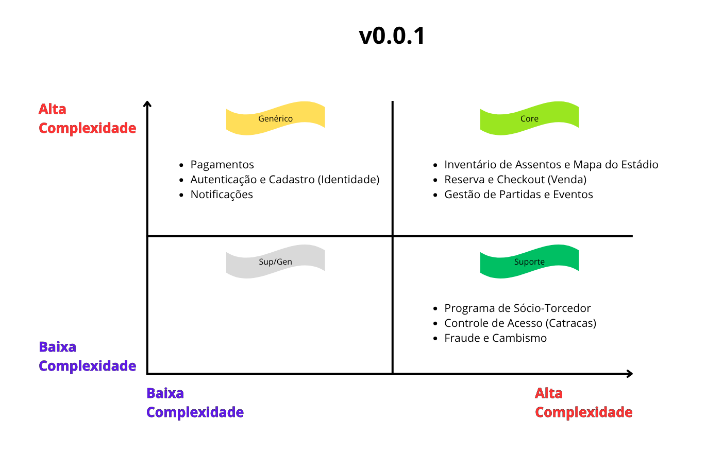

# MatchPass Project

O MatchPass é uma plataforma focada na venda de ingressos para partidas de futebol, priorizando a experiência do usuário, escalabilidade e alta resiliência. O sistema é construído sob uma arquitetura modular que facilita a manutenção e a integração contínua de novas funcionalidades.

---

## Sobre o Projeto
* **Domínio Central:** Venda de ingressos para partidas de futebol.
* **Versão Atual:** `v0.0.1`

## Arquitetura
O sistema utiliza uma abordagem de **Microsserviços**, permitindo a independência entre contextos (Bounded Contexts) e garantindo que o sistema seja facilmente escalável.

### Definição de Domínios
| Subdomínio | Descrição |
| :--- | :--- |
| **Core** | *Em breve* |
| **Suporte** | *Em breve* |
| **Genérico** | *Em breve* |





---

## Stack Tecnológica

### Backend
* **Tecnologias:** *Em breve*

### Frontend
* **Tecnologias:** *Em breve*

### Banco de Dados
* *Em breve*

---

## Estrutura do Projeto
```text
MatchPassProject/
├── matchpass-frontend/
└── matchpass-backend/
└── matchpass-database/
